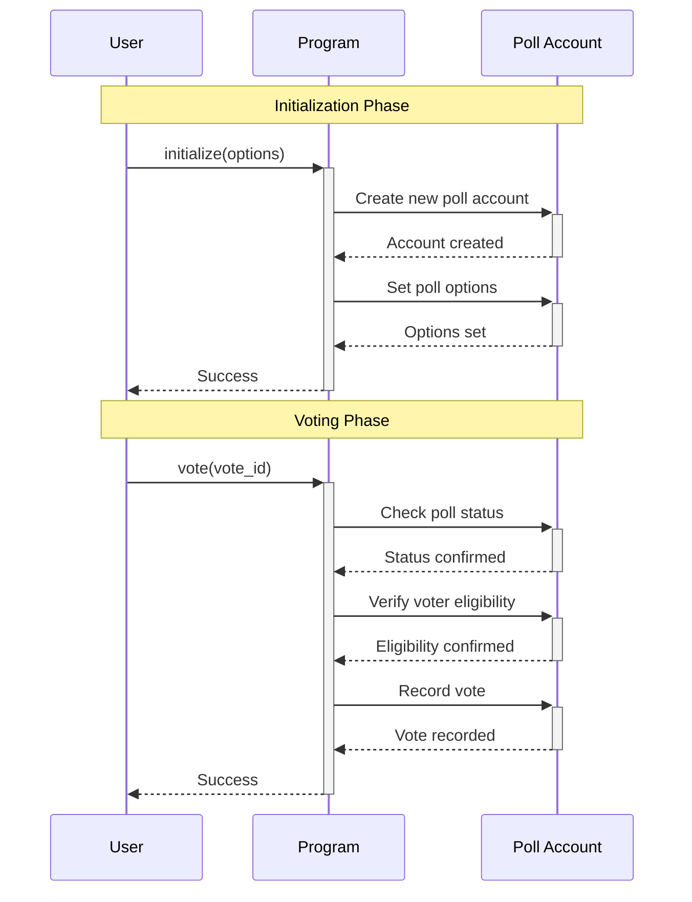

# Solana Voting Program

A decentralized voting system built on Solana using the Anchor framework. This program implements a secure, on-chain polling mechanism with vote tracking and verification capabilities.

## Features

- Create polls with custom options
- Secure voting mechanism
- Vote tracking and verification
- Optimized storage (1904 bytes per poll)
- Maximum 5 voting options
- Maximum 50 voters per poll

## System Architecture

The program operates through a three-party interaction between Users, the Program, and Poll Accounts. The following sequence diagram illustrates the complete flow of operations:



## Getting Started

### Prerequisites

- Rust installed
- Solana CLI configured
- Anchor framework installed
- Node.js and npm/yarn

### Installation

```bash
# Clone the repository
git clone https://github.com/your-username/solana-voting-program.git

# Change into the project directory
cd solana-voting-program

# Install dependencies
npm install
```

## Deployment

```bash
# Build the program
anchor build

# Deploy to localnet
anchor deploy --provider.cluster local

# Deploy to devnet
anchor deploy --provider.cluster devnet
```

## Usage

The program provides two main functions:

### 1. Initialize Poll

Creates a new poll with specified options:

```bash
anchor invoke initialize \
  --provider.cluster local \
  --accounts '["poll_account_key", "owner_key"]' \
  --arguments '["Option 1", "Option 2", "Option 3"]'
```

### 2. Cast Vote

Records a vote for a specific option:

```bash
anchor invoke vote \
  --provider.cluster local \
  --accounts '["poll_account_key", "voter_key"]' \
  --arguments '1'
```

## Technical Details

- Program size: 1904 bytes
- Storage layout:
  - Options array: 299 bytes (5 options × 59 bytes)
  - Voters array: 1604 bytes (50 voters × 32 bytes)
  - Finished flag: 1 byte

## Testing

```bash
anchor test
```

## Contributing

Contributions are welcome! Please submit pull requests with:

- Clear commit messages
- Updated documentation
- Passing tests

## License

MIT License

Permission is hereby granted, free of charge, to any person obtaining a copy
of this software and associated documentation files (the "Software"), to deal
in the Software without restriction, including without limitation the rights
to use, copy, modify, merge, publish, distribute, sublicense, and/or sell
copies of the Software, and to permit persons to whom the Software is
furnished to do so, subject to the following conditions:

The above copyright notice and this permission notice shall be included in all
copies or substantial portions of the Software.
